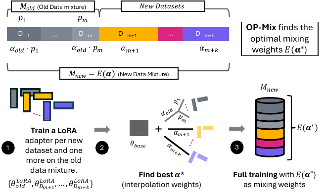

# On Policy Mix

<p align="center">
  
</p>


## Overview

This repo contains the code for reproducing results in the paper "Efficient and Simple Data Mixing All The Time."

We ran experiments with `olmix` as a dependency, and you can find the original code in `pipeline/continual_opm.py` and `pipeline/continual_sdft.py`. To get started without this dependency, try the code in `pipeline/continual_opm_standalone.py` or `pipeline/continual_sdft_standalone.py`

## Abstract

Data mixing is a consequential problem throughout language model training. In pretraining, data composition is a key determinant of model quality; in continual learning and adaptation, it governs what is retained and acquired. Yet existing data mixing methods address only one phase of this lifecycle at a time: some require smaller proxy models tied to a single training phase, others assume a fixed domain set, and continual learning lacks principled guidance altogether. We argue that data mixing is fundamentally an online decision making problem---one that recurs throughout training and demands a single, unified solution. We introduce OP-Mix (On-Policy Mix), a data mixing algorithm that operates across the entire language model training lifecycle. Our main insight is that candidate data mixtures can be cheaply simulated by interpolating between low-rank adapters trained directly on the current model, eliminating separate proxy models and ensuring the search is always grounded in the model's actual learning dynamics. Across pretraining, continual midtraining, and continual instruction tuning, OP-Mix consistently finds near-optimal mixtures while using a fraction of the compute of the baselines. In pretraining, OP-Mix improves upon training without mixing by 6.3% in average perplexity. For continual learning, OP-Mix matches the performance of both retraining and on-policy distillation while using 66% and 95% less overall compute, respectively. OP-Mix suggests a different view of language model training: not a sequence of distinct phases, but a single continuous process of learning from data.

## Installation

Create a Python environment and install the repo dependencies:

```bash
pip install -r requirements.txt
```

The core training path in `train.py` also imports `hf_olmo` and `olmo_core`, so those packages must be available in the environment you use for OLMo-style training and evaluation.

Next, download the data:
- Pretraining: <https://huggingface.co/datasets/allenai/DataDecide-data-recipes/tree/main>
- SDFT: <https://github.com/idanshen/Self-Distillation>

## Entry points

### Pretraining

```bash
python train.py \
  --model_dir /path/to/model \
  --train_data_file data-mixes/arxiv_train.txt data-mixes/stackexchange_train.txt \
  --train_weights 0.5 0.5 \
  --eval_data_file data-mixes/arxiv_eval.txt data-mixes/stackexchange_eval.txt \
  --output_dir runs/train_example \
  --data_root /path/to/tokenized-data
```

### Pretraining evaluation

```bash
python eval.py \
  --model_dir /path/to/model-or-checkpoint \
  --data_file data-mixes/arxiv_eval.txt data-mixes/stackexchange_eval.txt \
  --output_dir runs/eval_example \
  --data_root /path/to/tokenized-data
```

###  SDFT training

```bash
export SDFT_DATA_ROOT=/path/to/sdft-data

python train_sdft.py \
  --output_dir runs/sdft_example \
  --model_name Qwen/Qwen2.5-7B-Instruct \
  --train_domains tooluse_data medical_data \
  --train_weights 0.5 0.5
```

### SDFT evaluation

```bash
export SDFT_DATA_ROOT=/path/to/sdft-data

python eval_sdft.py \
  --model_a Qwen/Qwen2.5-7B-Instruct \
  --model_b /path/to/checkpoint \
  --eval_domains medical_data science_data tooluse_data \
  --alphas 0.0 0.5 1.0 \
  --output_dir runs/lmc_sdft_example
```
